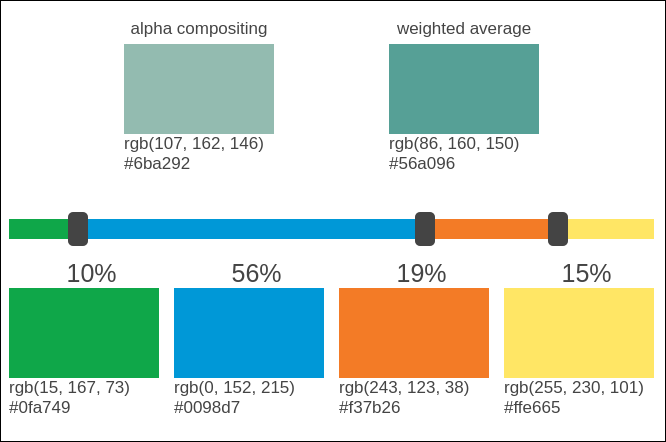

# Color blending demo

## How to make a new color from a combination of existing colors

This web page was written to answer a Stack Overflow question:

http://stackoverflow.com/questions/29951130/how-can-i-create-a-color-with-values-for-green-blue-orange-and-gold-only/

The page presents a palette of four predefined colors that are mixed
with two methods&mdash;alpha compositing and arithmetic average&mdash;to
make a pair of new colors. The proportions of the predefined colors can
be adjusted by sliding the bars above the color palette.

